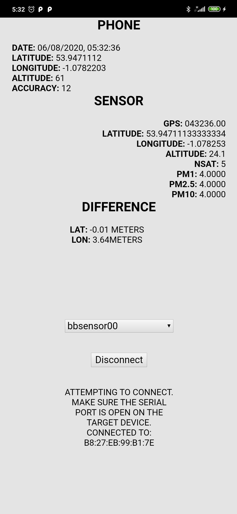
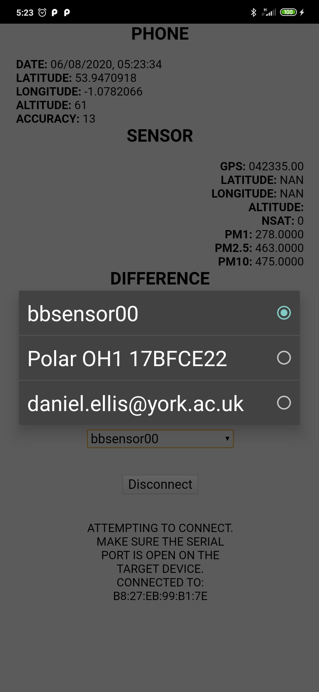

# BBSensorCal_Android
A phone app to read bluetooth sensor output, compare real time readings and the accuaracy of the gps device. 
RPI must be configured in debug mode. Here it outputs results once per time cycle. (set to 10 seconds for the time being, but will be ~ 5 mintues when sensors are operational. 




## adding a new device
The RPI sensors are programmed to broadcast as visible for 3 minutes following boot. This is the pairing window for new devices. 

## connecting
Once the pi has loaded establish a connection from your portable device



## enabling debug mode (which includes bluetooth)
Jumper cable will connect two pins. 

## phone comparison log location
apps com.bbsensor x.csv


# APK location 
After running `cordova build android` the required apk file is generated at :

```/platforms/android/app/build/outputs/apk/debug/app-debug.apk```

this can be installed using *adb*. 
